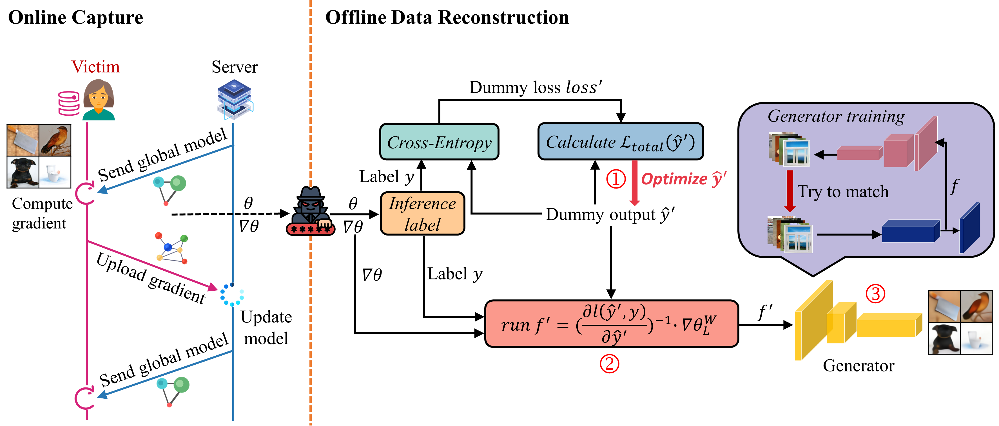
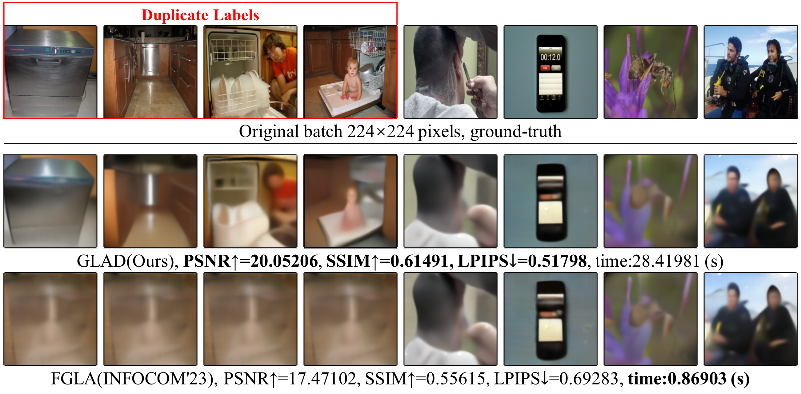

# GLAD: Gradient Leakage Attacks in Federated Learning with Duplicate Labels
## Abstract

GLAD, a gradient leakage attack (GLA) method, can reconstructe private training data in 30 seconds even under mainstream defense mechanisms (additive noise, gradient clipping,  gradient specification). GLAD addresses the challenge of duplicate labels for GLA, thus push the GLA more realistic.

## Overview

The whole attack process can be composed of three phases as:

- Optimize the model output to minimize the loss term by optimization-based technology.
- Seperate the feature map from the averaged gradients by the obtained model output.
- Generate the private training data by inputting the separated feature map into the pre-trained generator which generates the data accoording to the feature map.



##  The core code of GLAD

```python
# Model output leakage
def Model_output_leakage(grad, model)
    pred_modelPred = torch.randn((batchsize, class_num)).to(device).requires_grad_(True) # torch.randn((batchsize, class_num)).to(device).requires_grad_(True)
    criterion = nn.CrossEntropyLoss()
    optimizer = torch.optim.Adam([pred_modelPred], lr=lr)
    ExpLR = torch.optim.lr_scheduler.ExponentialLR(optimizer, gamma=0.88)
    ydldy_target = torch.mm(grad[-2], model.fc.weight.data.transpose(0, -1))
    pred_modelloss = pred_loss(grad, label, batchsize, defence_method)
    pred_modelloss = pred_modelloss.detach().clone()
        for iter in range(Iteration):
            optimizer.zero_grad()
            predloss = criterion(pred_modelPred, label)
            predloss.backward(retain_graph=True)
            dldy = pred_modelPred.grad
            pred_dldy = dldy.detach().clone()
            ydldy = torch.mm(dldy.transpose(0, -1), pred_modelPred - model.fc.bias.data)
            # ydldy = defense("clipping", [ydldy], model, 0, label, 8)[0]
            w_loss = (ydldy - ydldy_target).pow(2).sum()
            b_loss = (torch.sum(dldy, 0) - grad[-1]).pow(2).sum()
            loss_loss = (predloss - pred_modelloss).pow(2).sum()
            # w_loss = torch.abs(torch.mul(w_lambda, ydldy - ydldy_target)).sum()
            # b_loss = torch.abs(torch.sum(dldy, 0) - grad[-1]).sum()
            # loss_loss = torch.abs(predloss - pred_modelloss).sum()
            # loss_loss = ((torch.abs(8.0 - predloss) + torch.abs(predloss - 6.0)) - torch.tensor(2.0)).pow(2)
            loss = 10000 * w_loss + b_loss + 100 * loss_loss
            loss.backward()
            optimizer.step()
            if iter % 1000 == 0:
                ExpLR.step()
    return pred_dldy
```

```python
# Feature map separation
def Feature_map_separation(dldy, grad):
    dl_dy_inv = torch.pinverse(dldy)
    fcin = torch.mm(grad[-2].transpose(0, -1), dl_dy_inv).transpose(0, -1)
    return fcin
```

```python
# Private data reconstrution
def Private_data_reconstrution(fcin, generator)
    reimgs = generator(fcin)
    return reimgs
```

## Simple Usage

- Download the [trained generator](https://drive.google.com/file/d/1ZXaoF-3abmrjMwhIRLEg5ri05W5dMEQI/view?usp=sharing) and place it in "./savedModel/"
- run main.py, and you can adjust the argument in main.py

also you can train your generator by run TrainGeneratorGtoImg.py

## Results

- Reconstruct private training data containing duplicate labels in 30 seconds.

​	

- Reconstruct private training data against mainstream defense mechanisms.


