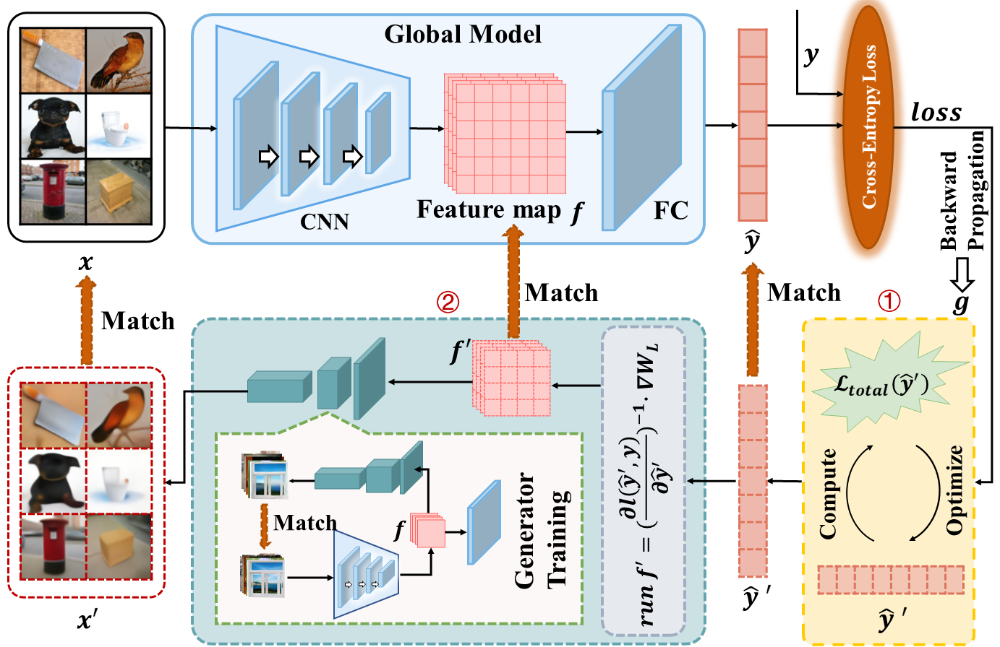
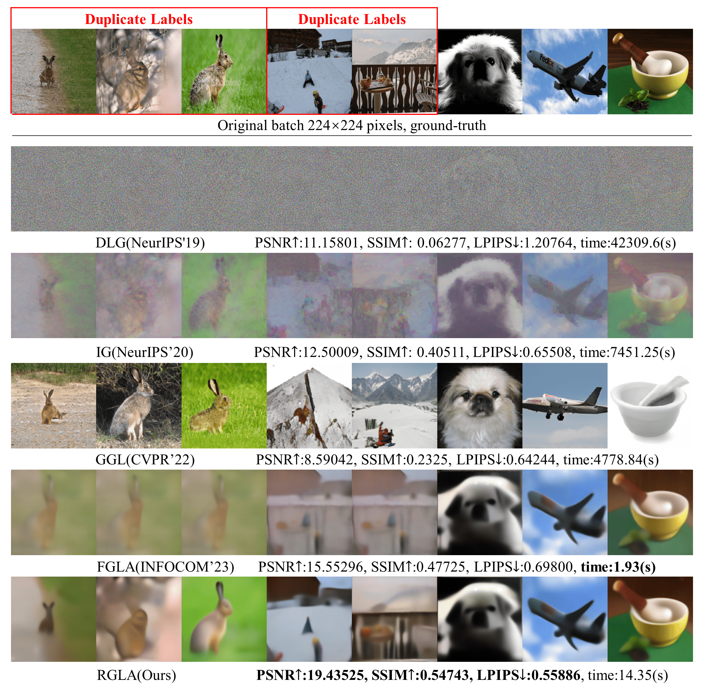

# Gradient Leakage Attack against Duplicate Labels via Model Output Reconstruction
## Abstract

GLAD, a gradient leakage attack (GLA) method, can reconstruct 224 $\times$ 224 pixels private training data of batch size 256 in 30 seconds while considering duplicate labels. GLAD addresses the challenge of high-resolution data and duplicate labels for GLAs, thus push the GLA more realistic. Extensive experiments demonstrate the state-of-the-art ability and robustness of GLAD to high resolution, duplicate labels, batch size, relatively strict defense methods, and initialization methods for the dummy model output.


## Overview

The whole attack process can be composed of three phases:

- Optimize the model output to invert cross-entropy by optimization-based technology.
- Disaggregate the feature map input into the last fully-connected layer from the averaged gradients by the obtained model output.
- Generate the private training data by inputting the separated feature map into the pre-trained generator which generates the data according to the feature map.




##  The core code of GLAD

```python
# Model output leakage
def Model_output_leakage(grad, model, label, batchsize):
    pred_modelPred = torch.randn((batchsize, class_num)).to(device).requires_grad_(True) # torch.randn((batchsize, class_num)).to(device).requires_grad_(True)
    criterion = nn.CrossEntropyLoss()
    optimizer = torch.optim.Adam([pred_modelPred], lr=lr)
    ExpLR = torch.optim.lr_scheduler.ExponentialLR(optimizer, gamma=0.88)
    ydldy_target = torch.mm(grad[-2], model.fc.weight.data.transpose(0, -1))
    pred_modelloss = pred_loss(grad, label, batchsize, defence_method)
    pred_modelloss = pred_modelloss.detach().clone()
    for iter in range(Iteration):
        optimizer.zero_grad()
        predloss = criterion(pred_modelPred, label)
        predloss.backward(retain_graph=True)
        dldy = pred_modelPred.grad
        pred_dldy = dldy.detach().clone()
        ydldy = torch.mm(dldy.transpose(0, -1), pred_modelPred - model.fc.bias.data)
        w_loss = (ydldy - ydldy_target).pow(2).sum()
        b_loss = (torch.sum(dldy, 0) - grad[-1]).pow(2).sum()
        loss_loss = (predloss - pred_modelloss).pow(2).sum()
        loss = 10000 * w_loss + b_loss + 100 * loss_loss
        loss.backward()
        optimizer.step()
        if iter % 1000 == 0:
            ExpLR.step()
    return pred_dldy
```

```python
# Feature map separation
def Feature_map_separation(dldy, grad):
    dl_dy_inv = torch.pinverse(dldy)
    fcin = torch.mm(grad[-2].transpose(0, -1), dl_dy_inv).transpose(0, -1)
    return fcin
```

```python
# Private data reconstrution
def Private_data_reconstrution(fcin, generator):
    reimgs = generator(fcin)
    return reimgs
```


## Simple Usage

- Download the [trained generator](https://drive.google.com/file/d/1ZXaoF-3abmrjMwhIRLEg5ri05W5dMEQI/view?usp=sharing) for the images of 224 $\times$ 224 or the [trained generator](https://drive.google.com/file/d/19mmn-DsaQ0Jc0GIheIMKX4ci8Fy1KFkI/view?usp=sharing) for the images of 336 $\times$ 336 and place it in "./savedModel/"
- run main.py, and you can adjust the argument in main.py

also, you can train your generator by running TrainGeneratorGtoImg.py


## Some Results

- Comparison with the state-of-the-art methods



- Reconstruct the data batch of 336$\times$336 pixels


- Reconstruct private training data with batch size of 256.


- Reconstruct private data from the datasets different from the auxiliary dataset

   

  

- Reconstruct private training data against mainstream defense mechanisms.


